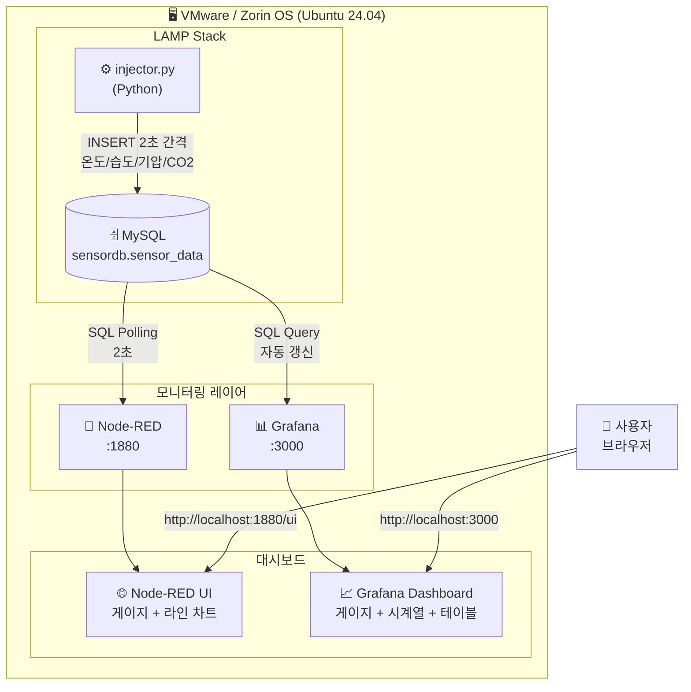
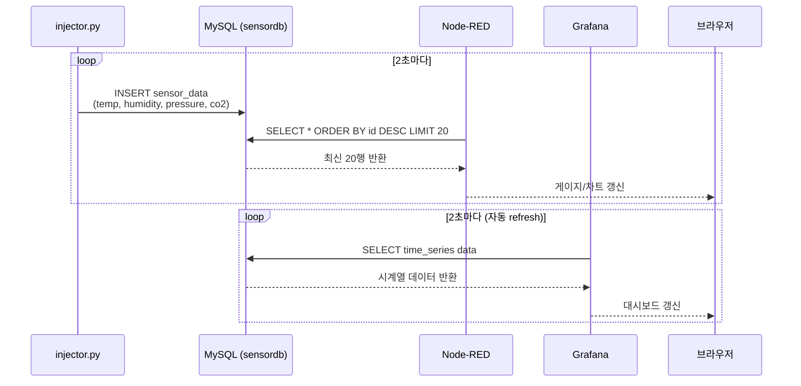

# LAMP Stack 실시간 센서 모니터링

> Python으로 가상 센서 데이터를 생성하여 MySQL에 저장하고,
> **Node-RED** 와 **Grafana** 두 가지 방식으로 실시간 대시보드를 구현한 프로젝트

---

## 시스템 구성

| 구성 요소 | 역할 |
|-----------|------|
| **Python (injector.py)** | 온도·습도·기압·CO2 랜덤 데이터 생성 → MySQL 저장 (2초 간격) |
| **MySQL (LAMP)** | 센서 데이터 저장소 (`sensordb.sensor_data`) |
| **Node-RED** | MySQL Polling → 게이지/차트 실시간 시각화 (포트 1880) |
| **Grafana** | MySQL → 대시보드 실시간 시각화 (포트 3000) |

---

## 전체 시스템 블록도



---

## 데이터 흐름



---

## 디렉토리 구조

```
lamp-monitor/
├── injector.py              # 가상 센서 데이터 생성기 (Python)
├── db_setup.sql             # MySQL DB/테이블/사용자 초기화
├── nodered_flow.json        # Node-RED 플로우 임포트 파일
├── grafana_datasource.yaml  # Grafana MySQL 데이터소스 설정
├── grafana_dashboard.json   # Grafana 대시보드 JSON
├── project.md               # 본 문서
└── repo_info.txt            # GitHub repo 정보 및 영상 안내
```

---

## 설치 및 실행

### 1. LAMP 기반 MySQL DB 초기화

```bash
mysql -u root < db_setup.sql
```

### 2. Python 의존성 설치 및 인젝터 실행

```bash
cd lamp-monitor
python3 -m venv .venv
source .venv/bin/activate
pip install mysql-connector-python
python3 injector.py
```

### 3. Node-RED 설치 및 실행

```bash
sudo npm install -g --unsafe-perm node-red
sudo npm install -g node-red-node-mysql node-red-dashboard
node-red
# 브라우저 → http://localhost:1880
# 메뉴 → Import → nodered_flow.json 붙여넣기
# MySQL 노드 비밀번호 → sensor1234 입력 후 Deploy
# 대시보드 → http://localhost:1880/ui
```

### 4. Grafana 설치 및 대시보드 구성

```bash
# Grafana 설치 (apt)
sudo apt-get install -y grafana
sudo systemctl start grafana-server

# 데이터소스 자동 적용
sudo cp grafana_datasource.yaml /etc/grafana/provisioning/datasources/
sudo systemctl restart grafana-server

# 브라우저 → http://localhost:3000 (admin/admin)
# Dashboards → Import → grafana_dashboard.json 업로드
```

---

## 동작 확인

| 항목 | URL | 확인 내용 |
|------|-----|-----------|
| Node-RED 편집기 | http://localhost:1880 | 플로우 실행 중 |
| Node-RED 대시보드 | http://localhost:1880/ui | 게이지 실시간 갱신 |
| Grafana | http://localhost:3000 | 시계열 그래프 실시간 갱신 |

---

## 제출 영상 목록

| 영상 | 내용 |
|------|------|
| `video1_nodered.mp4` | injector.py 실행 + Node-RED 대시보드 실시간 갱신 |
| `video2_grafana.mp4` | injector.py 실행 + Grafana 대시보드 실시간 갱신 |
